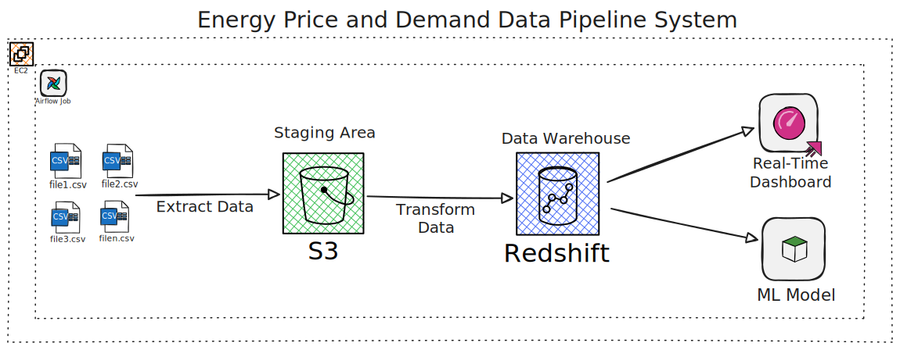

# Energy-Price-and-Demand-Pipeline

## Overview

This repository contains an ETL pipeline that fetches monthly electricity price and demand data by region in Australia. The source files, in CSV format, contain energy price and demand data at 30-minute intervals. The pipeline extracts the data from the Australian Energy Market Operator (AEMO) website and uploads the data to an AWS S3 bucket, which serves as the landing location for the data. The project incorporates asynchronous functionality to handle multiple requests concurrently, ensuring efficient data fetching and processing.

In addition to data engineering tasks, the project incorporates a machine learning model that predicts energy demand for the upcoming month. A dashboard is also implemented to present the data, allowing users to browse demand and pricing trends by region.

## Project Components

- **Data Extraction**: The `get_url` function generates URLs for the desired data files based on specified parameters such as year, month, and province. The `get_data` function asynchronously fetches the data from these URLs and returns the data in CSV format.

- **Data Upload**: The `write_to_s3` function establishes a connection to an AWS S3 bucket using credentials, enabling the upload of fetched data files to the specified S3 bucket.

- **Data Processing**: The `process_data` function processes the fetched data, converting it into a suitable format for analysis. It handles missing values and ensures the data is clean and ready for further processing.

- **Data Storage**: The processed data is stored in an AWS RDS Instance for efficient querying and analysis.

- **Machine Learning Model**: A predictive model analyzes historical energy demand and price data, generating forecasts for the upcoming month based on identified patterns.

- **Data Dashboard**: An interactive dashboard presents energy demand and pricing data, enabling users to browse trends by region and gain valuable insights into market fluctuations.
